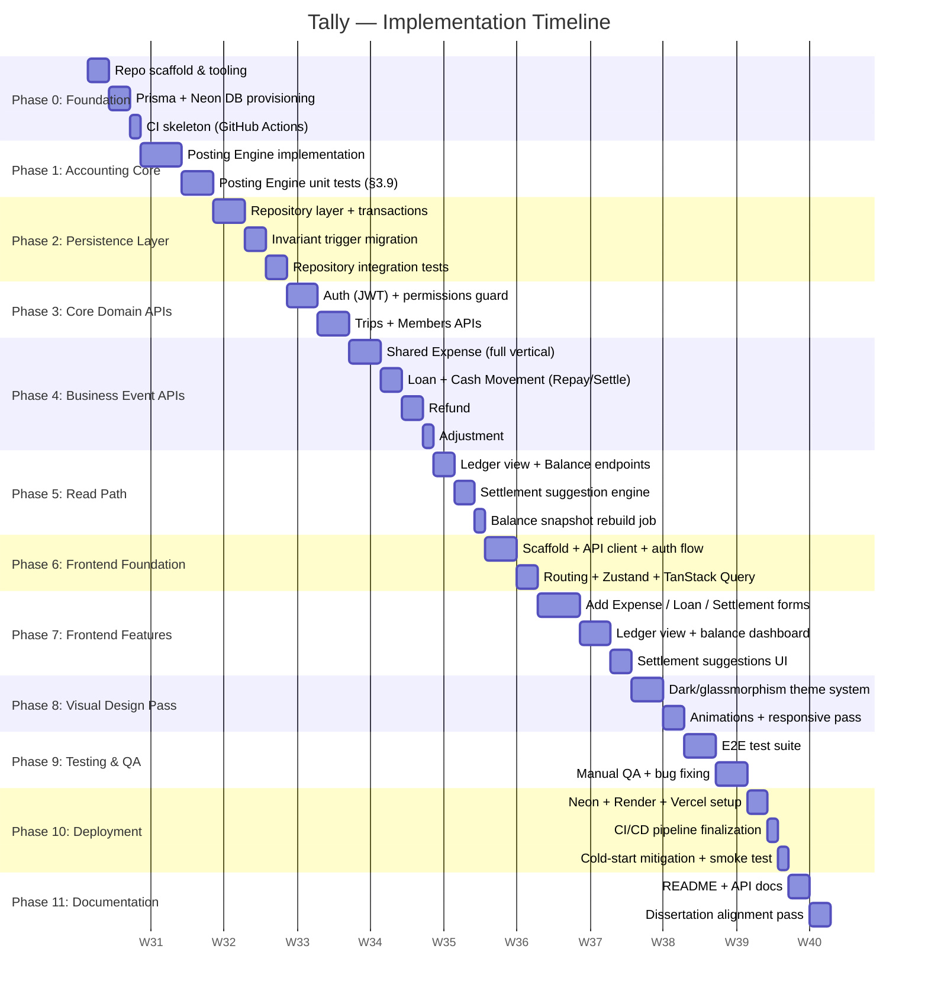

# Tally — Implementation Development Timeline

> Covers the **Implementation** phase of the SDLC only. Planning, Requirements
> Analysis, and System Design are treated as complete, per `PROJECT_CONTEXT.md`
> and `ARCHITECTURE.md`. This document sequences the *build*.

Assumption: timeline is expressed in **relative weeks (W1, W2, ...)** starting from
whenever implementation actually begins, since no fixed FYP submission date was
provided. Map these week numbers onto your actual calendar and adjust durations
if your remaining time budget is tighter or looser than 10 weeks.

---

## Gantt Chart (Mermaid)



*(If your Markdown viewer doesn't render Mermaid, use the phase tables below — they contain identical information.)*

---

## Phase-by-Phase Breakdown

### Phase 0 — Foundation (5 days)

| Task | Output | Depends on |
|---|---|---|
| Scaffold monorepo (`backend/`, `frontend/`), init NestJS, install Prisma | Runnable empty Nest app | — |
| Provision Neon free-tier Postgres project, connect `DATABASE_URL` | Live dev database | Repo scaffold |
| Copy in `schema.prisma`, run first migration | Tables exist in Neon | DB provisioned |
| GitHub Actions skeleton: lint + test on push | CI runs (even with no tests yet) | Repo scaffold |

**Exit criteria:** `prisma migrate dev` succeeds against Neon; CI pipeline is green on an empty test suite.

---

### Phase 1 — Accounting Core / Posting Engine (7 days)

| Task | Output | Depends on |
|---|---|---|
| Implement `computeSharedExpensePostings` (incl. multi-payer netting) | Pure function | Phase 0 |
| Implement `computeCashMovementPostings` (shared by Repayment + Settlement) | Pure function | — |
| Implement `computeRefundPostings` (proportional, `refundOf`-scoped) | Pure function | — |
| Implement `computeAdjustmentPostings` | Pure function | — |
| Implement `validateZeroSum` shared guard | Pure function | All above |
| Write `posting-engine.spec.ts`, one `describe` block per ACCOUNTING.md §3.9 bullet | Full green test suite | All above |

**Exit criteria:** every rule in ACCOUNTING.md §3.5's table has a passing, non-mocked unit test. This is the single most important exit criterion in the entire timeline — do not proceed to Phase 2 with a red or incomplete Posting Engine suite.

---

### Phase 2 — Persistence Layer (7 days)

| Task | Output | Depends on |
|---|---|---|
| `EventsRepository.saveEvent()` — atomic `$transaction` (BusinessEvent + Posting[]) | Working repository method | Phase 1 |
| Apply `migration_enforce_invariants.sql` (triggers, REVOKE) against Neon | Enforced DB constraints | Phase 0 |
| Confirm `app_runtime` role actually has UPDATE/DELETE revoked (not the Neon owner role) | Verified least-privilege setup | Migration applied |
| Integration tests: attempt a bad write (non-zero sum, zero postings, refund without `refundOfId`) and confirm Postgres rejects it | Green integration suite | Both above |

**Exit criteria:** a deliberately "wrong" write attempted directly against the repository is rejected by the database itself, not just by application code.

---

### Phase 3 — Core Domain APIs (6 days)

| Task | Output | Depends on |
|---|---|---|
| JWT auth strategy + guard | Login-protected routes | Phase 0 |
| Permissions guard/decorator (Owner/Admin/Member/Viewer) | `@RequireRole()` enforced | Auth strategy |
| Trips CRUD (create, get, archive — never hard-delete) | Trips API | Auth |
| Members API (invite, join, leave) | Members API | Trips API |

**Exit criteria:** a user can register, log in, create a trip, and add members via HTTP, with role checks enforced server-side (test with a Viewer attempting a write and confirm 403).

---

### Phase 4 — Business Event APIs (8 days)

Build one full vertical slice at a time — Controller → Service → Posting Engine → Repository — starting with the most common case:

| Task | Depends on |
|---|---|
| Shared Expense: full vertical, incl. category/metadata split (§3.8.1) | Phase 2, Phase 3 |
| Loan + Cash Movement (single handler, `REPAYMENT`/`SETTLEMENT` as labels only) | Shared Expense slice proven |
| Refund (requires `refundOfId`, proportional reversal) | Cash Movement slice |
| Adjustment (admin-only, still zero-sum checked) | Refund slice |

**Exit criteria:** all six Business Event types can be created via HTTP, each producing correct, balanced Postings, verified against the Phase 1 test cases but now through the full stack (e2e, not unit).

---

### Phase 5 — Read Path (5 days)

| Task | Output | Depends on |
|---|---|---|
| Balance endpoint (`SUM(Posting.amount)` per member) | Live balance API | Phase 4 |
| Member ledger view endpoint (filtered/joined Postings + BusinessEvents) | Ledger API | Phase 4 |
| Settlement suggestion service (debt simplification, read-only) | Suggestion API | Balance endpoint |
| `BalanceSnapshot` rebuild job (scheduled or on-demand) | Cache rebuild endpoint/job | Balance endpoint |

**Exit criteria:** balances and ledger views are correct for a manually seeded multi-event trip, and the settlement suggestion never touches `Posting`/`BusinessEvent` (verify via test asserting no writes occur when the suggestion endpoint is called).

---

### Phase 6 — Frontend Foundation (5 days)

| Task | Output | Depends on |
|---|---|---|
| Vite + React + TS + Tailwind scaffold | Running dev server | — |
| API client (Axios) with auth token interceptor | `api/` layer | Phase 3 (auth) |
| Zustand stores (UI state) + TanStack Query setup (server state) | State layers wired | API client |
| Routing (trip list, trip detail, login) | Navigable skeleton | — |

**Exit criteria:** user can log in through the UI and see an (empty) trip dashboard, all state management wiring in place before any real feature UI is built.

---

### Phase 7 — Frontend Features (9 days)

| Task | Output | Depends on |
|---|---|---|
| Add Shared Expense form (multi-payer, split methods) | Working write flow | Phase 6, Phase 4 |
| Add Loan / Repayment / Settlement forms | Working write flows | Shared Expense form |
| Ledger view + balance dashboard | Working read flow | Phase 5, Phase 6 |
| Settlement suggestions UI (clearly labeled as suggestions, not history) | Suggestion display | Ledger view |

**Exit criteria:** a full user journey — create trip, add members, record a shared expense, a loan, a settlement, view resulting balances — works end to end through the UI with no accounting vocabulary ("debit"/"credit"/"posting") visible anywhere.

---

### Phase 8 — Visual Design Pass (5 days)

| Task | Output | Depends on |
|---|---|---|
| Dark theme + glassmorphism component system (per your established aesthetic preference — deep space palette, gold accents, cinematic feel) | Theme tokens/Tailwind config | Phase 7 functional UI exists |
| Micro-animations (Framer Motion) on state transitions | Polished interactions | Theme system |
| Responsive pass (mobile/tablet breakpoints) | Usable on all screen sizes | — |

**Exit criteria:** functional UI from Phase 7 is restyled, not rebuilt — this phase should touch CSS/theme/animation only, not component logic, which is why it comes after functionality is proven.

---

### Phase 9 — Testing & QA (6 days)

| Task | Output | Depends on |
|---|---|---|
| Full E2E suite (Supertest, all 6 event types + rejection paths) | Automated regression safety net | Phase 4, Phase 5 |
| Manual QA pass against the full user journey | Bug list | Phase 8 |
| Bug fixing | Stabilized build | QA pass |

**Exit criteria:** CI is fully green (unit + integration + e2e), and a manual walkthrough of the entire user journey produces no known bugs.

---

### Phase 10 — Deployment (4 days)

| Task | Output | Depends on |
|---|---|---|
| Provision Render (backend) + Vercel/Netlify (frontend), connect to Neon | Live URLs | Phase 9 |
| `prisma migrate deploy` + invariant migration run against production DB | Production schema matches dev | — |
| CI/CD: auto-deploy on merge to `main` | Automated pipeline | GitHub Actions from Phase 0 |
| Cold-start mitigation plan (ping strategy or documented limitation) + smoke test in production | Verified live demo readiness | All above |

**Exit criteria:** the live, publicly reachable app performs the full user journey correctly, including a fresh cold-start request.

---

### Phase 11 — Documentation (4 days)

| Task | Output | Depends on |
|---|---|---|
| `README.md` (setup, run, deploy instructions) | Onboarding doc | Phase 10 |
| API documentation (endpoints, request/response shapes per event type) | Reference doc | Phase 4 |
| Dissertation alignment pass — cross-check implementation against `PROJECT_CONTEXT.md` and `ACCOUNTING.md` for any drift, document deliberate deviations | Consistency report | All prior phases |

**Exit criteria:** someone with no prior context could clone the repo, follow the README, and run the full system locally and in production.

---

## Total Estimate

**~10 weeks (66 working days)** at the durations above. This is a planning estimate, not a guarantee — Phases 1 and 2 are the highest-risk/highest-reward phases (get the accounting core wrong and everything downstream needs rework), so consider protecting their time budget first if the overall schedule needs to compress.

## Critical Path

```
Phase 0 → Phase 1 → Phase 2 → Phase 3 → Phase 4 → Phase 5 → Phase 7 → Phase 9 → Phase 10
```

Phase 6 (frontend foundation) and Phase 8 (visual design) have some slack and could run partially in parallel with backend phases if more than one person — or one very disciplined agentic pipeline — is working on this. Phase 11 (documentation) can be written incrementally throughout rather than saved entirely for the end, despite being sequenced last here for planning clarity.
