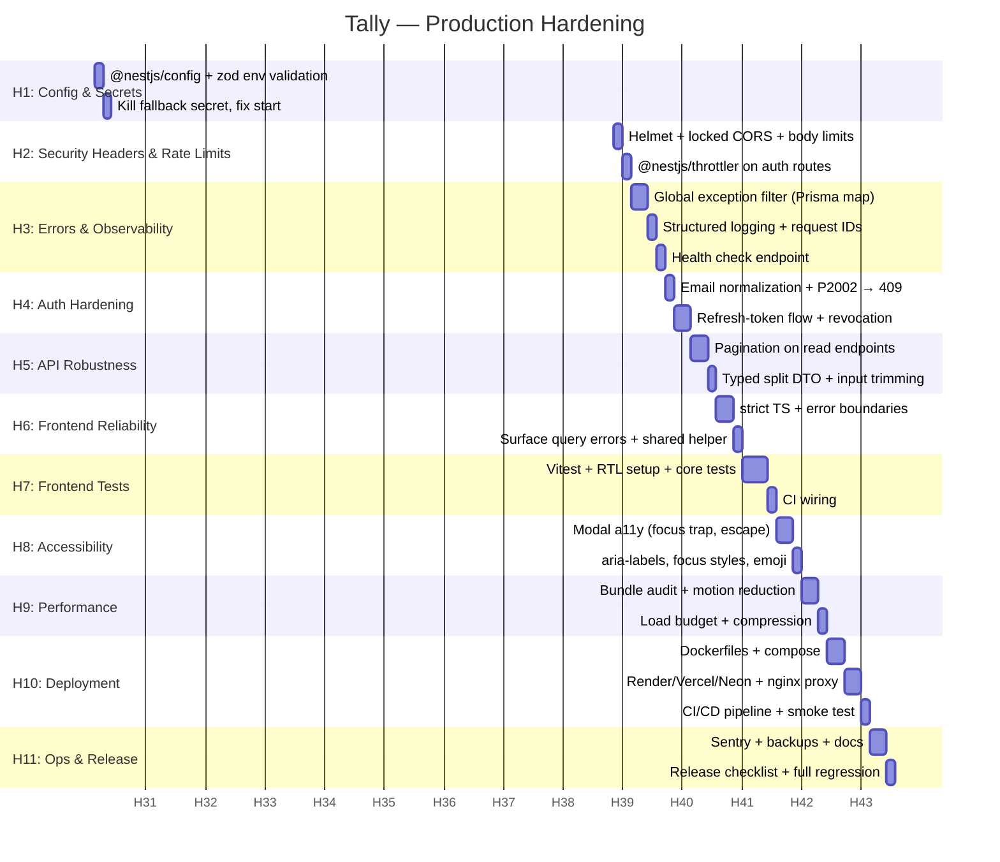

# Tally — Production Hardening Plan

> Companion to `ARCHITECTURE.md` and `DEVELOPMENT_TIMELINE.md`. Covers the work
> required to take Tally from *feature-complete prototype* (Phases 0–8 of the
> implementation timeline) to *production-ready*: security hardening,
> reliability, observability, testing, performance, and deployment.
>
> Each phase lists concrete tasks with file-level pointers, a **Definition of
> Done**, and **verification steps** (the exact commands to prove the work).

---

## Summary of gaps being addressed

The current audit (see analysis) found the codebase **not production-ready**.
Strengths: pure posting engine with excellent tests, DB-enforced financial
invariants, mass-assignment protection, RBAC with defense in depth, XSS-clean
frontend, working CI. The gaps, mapped to phases:

| # | Gap (severity) | Phase |
|---|---|---|
| 1 | Hardcoded JWT fallback secret — forgeable tokens (critical) | H1 |
| 2 | No env loading at runtime / no env validation (critical) | H1 |
| 3 | No rate limiting on auth endpoints (critical) | H2 |
| 4 | CORS fully open, no Helmet (critical) | H2 |
| 5 | Prisma errors → raw 500s; inconsistent error shapes (high) | H3 |
| 6 | No health check / structured logging / request IDs (high) | H3 |
| 7 | Auth gaps: no refresh token, email case-sensitivity, P2002 race → 500, bcrypt 10 rounds (high) | H4 |
| 8 | No pagination; untyped `split: any` DTO (high) | H5 |
| 9 | Frontend `strict: false`; swallowed query errors; no error boundary (high) | H6 |
| 10 | Zero frontend tests (high) | H7 |
| 11 | Weak a11y: no focus trap, no aria-labels, missing focus styles (medium) | H8 |
| 12 | Heavy initial bundle; framer-motion 40 kB gzip (medium) | H9 |
| 13 | No Docker/deployment config; no `VITE_API_URL` (blocker) | H10 |
| 14 | Observability, backups, release checklist (medium) | H11 |

---

## Gantt Chart (Mermaid)



*(If your Markdown viewer doesn't render Mermaid, use the phase tables below — they contain identical information.)*

---

## Phase H1 — Config & Secrets (backend)

**Goal:** eliminate the forgeable-token risk and make the app fail *fast and
loud* when required config is missing.

### Tasks

1. **Add `@nestjs/config`** (`ConfigModule.forRoot({ isGlobal: true })`) or use
   `node --env-file=.env` in scripts — decide one, be consistent.
   - `backend/src/app.module.ts`: import `ConfigModule`.
   - `backend/package.json` `start:prod`: `node --env-file=.env dist/main` (or
     rely on ConfigModule which loads `.env` itself). Ensure `start:dev` behaves
     identically in dev.
2. **Remove the hardcoded fallback secrets:**
   - `backend/src/auth/auth.module.ts:15` — `secret: process.env.JWT_SECRET ?? 'dev-secret-change-in-production'` → `secret: config.getOrThrow<string>('JWT_SECRET')`.
   - `backend/src/auth/jwt.strategy.ts:21` — same change.
   - The app must **refuse to boot** when `JWT_SECRET` is missing/unset in
     production (`NODE_ENV === 'production'`). No silent dev-secret fallback.
3. **Add env validation (zod):**
   - `backend/src/config/env.validation.ts` — zod schema validating:
     - `DATABASE_URL` (must be a valid `postgresql://` URL)
     - `JWT_SECRET` (min length 32 chars in production)
     - `JWT_EXPIRES_IN` (optional, default `7d`)
     - `PORT` (optional, default 3000)
     - `NODE_ENV` (`development | test | production`, default `development`)
     - `CORS_ORIGINS` (comma-separated, optional — dev defaults to
       `http://localhost:5173`)
     - `FRONTEND_URL` (used for CORS + future flows)
   - Fail fast: log the missing/incorrect vars and `process.exit(1)` on
     validation error.
4. **Update `.env.example`** (backend) to document every variable with a
   comment, including `NODE_ENV=production` for prod deploys and a
   strong-secret generator hint (`openssl rand -base64 48`).
5. **CI:** add a smoke assertion that the prod build refuses to boot without
   `JWT_SECRET` (a tiny test or a `--dry-run` style check in CI).

### Definition of Done

- No `?? 'dev-secret-change-in-production'` anywhere in `src/`.
- `node dist/main` without `.env` exits non-zero with a clear message.
- `.env.example` documents all env vars.
- `pnpm --filter backend build` passes; `pnpm --filter backend test:posting-engine` still green.

### Verification

```bash
pnpm --filter backend build
JWT_SECRET= node dist/main      # expect: fail-fast with clear error
pnpm --filter backend test:posting-engine
```

---

## Phase H2 — Security Headers & Rate Limiting (backend)

**Goal:** close the brute-force and header/CORS exposure gaps.

### Tasks

1. **Helmet:**
   - `pnpm --filter backend add helmet` + `@types/helmet` (dev).
   - `backend/src/main.ts`: `app.use(helmet())` — default headers (CSP,
     HSTS, X-Frame-Options, etc.). Add HSTS only in production
     (`helmet({ hsts: NODE_ENV === 'production' })`).
2. **Locked-down CORS:**
   - Replace `app.enableCors()` with `app.enableCors({ origin: <parsed CORS_ORIGINS/FRONTEND_URL> })`.
   - Parse the comma-separated `CORS_ORIGINS` from config; dev default
     `http://localhost:5173`.
   - No credentials/cookies currently used → keep `credentials: false` until a
     cookie-based flow is introduced.
3. **Rate limiting:**
   - `pnpm --filter backend add @nestjs/throttler`.
   - `app.module.ts`: `ThrottlerModule.forRoot([{ ttl: 60_000, limit: 100 }])`
     global, plus `@Throttle({ default: { limit: 5, ttl: 60_000 } })` on
     `POST /auth/login` and `POST /auth/register`.
   - Register `APP_GUARD` throttler guard globally.
   - Configure `app.set('trust proxy', 1)` (or read from config) so the limit
     keys on real client IPs when deployed behind Render's proxy.
   - Emit a `429` with a sensible retry-after message.
4. **Body size + timeouts + graceful shutdown:**
   - `app.use(express.json({ limit: '100kb' }))` (explicit; events payloads are
     small — no file uploads yet).
   - `app.enableShutdownHooks()` in `main.ts` for clean Prisma disconnect.
   - Server timeout: `app.getHttpServer().requestTimeout = 30_000` (or via
     `NestExpressApplication` option).
5. **Remove `X-Powered-By`** (helmet does this by default).

### Definition of Done

- `curl -I` against the API shows Helmet headers (no `X-Powered-By`).
- 6 rapid POSTs to `/auth/login` → 429.
- CORS: request from an origin not in the allowlist is rejected.
- All existing tests still pass (rate limit must not break e2e — add
  `ThrottlerGuard` override in e2e via `APP_GUARD` skip in test module or set
  high limits in test env).

### Verification

```bash
pnpm --filter backend test:e2e
curl -s -o /dev/null -w '%{http_code}' -X POST http://localhost:3000/auth/login -d '{}' # repeated x6 → 429
```

---

## Phase H3 — Error Handling & Observability (backend)

**Goal:** no raw 500s for known failure modes; structured, traceable logs;
health endpoints for orchestrators.

### Tasks

1. **Global exception filter** — `backend/src/common/filters/all-exceptions.filter.ts`:
   - Replace/extend `DomainErrorFilter` (keep the 422 posting-engine path).
   - Map Prisma errors:
     - `P2002` (unique violation) → **409** with a generic "already exists" message.
     - `P2025` (record not found) → **404**.
     - `P2003` (FK violation) → **400/409**.
     - Everything else → **500**, message masked in production
       (`NODE_ENV === 'production'` → log the real error server-side, return
       "Internal server error" to the client).
   - Standardize response shape: `{ statusCode, error, message, path, timestamp, requestId }`.
   - Register via `APP_FILTER` provider so it's global.
2. **Structured logging (pino):**
   - `pnpm --filter backend add nestjs-pino pino-http pino-pretty` (dev).
   - Configure `LoggerModule.forRoot` with `pino-http`; redact
     `req.headers.authorization` (JWT) and any `password` fields.
   - Request-ID middleware: add `x-request-id` (or use pino-http's built-in
     `genReqId`) and echo it on responses; include in error filter output.
   - Log level from `LOG_LEVEL` env (default `info`; `debug` in dev).
3. **Health check:**
   - `pnpm --filter backend add @nestjs/terminus`.
   - `backend/src/health/health.module.ts` + `health.controller.ts`:
     - `GET /health` → liveness (200 with `{ status: 'ok' }`).
     - `GET /health/ready` → readiness: `PrismaHealthIndicator` (real DB
       `SELECT 1`), returns 503 when DB unreachable.
   - No auth on health endpoints (public, but they must not leak data — return
     only status).
4. **Graceful failure of `findUniqueOrThrow` paths** — after (1), P2025 → 404
   automatically; audit `trips.service.ts`, `members.service.ts`,
   `events.service.ts`, `ledger.service.ts` for any remaining unhandled throws.

### Definition of Done

- `POST /auth/register` with a duplicate email (concurrent race) → 409, not 500.
- Invalid trip id in any route → 404 with standardized shape.
- `/health` returns 200; `/health/ready` returns 503 when DB is stopped
  (verify manually by pausing Postgres).
- Every response carries `x-request-id`; logs are JSON with redacted
  authorization headers.

### Verification

```bash
pnpm --filter backend build && pnpm --filter backend start:prod &
curl -s localhost:3000/health
curl -s -X POST localhost:3000/auth/register -H 'content-type: application/json' -d '{"email":"a@b.c","password":"aaaaaaaa"}'   # twice → second is 409
pnpm --filter backend test:integration
```

---

## Phase H4 — Auth Hardening (backend)

**Goal:** fix known auth weaknesses without over-engineering.

### Tasks

1. **Email normalization:**
   - `backend/src/auth/auth.service.ts`: `email.trim().toLowerCase()` before
     `findUnique`/`create`; same normalization in `members.service.ts`
     `addMember` lookup. Prevents duplicate accounts.
   - Keep a DB migration? No — normalization at the boundary is enough; existing
     rows can be cleaned by a one-off script if needed (document it).
2. **P2002 race → 409** — rely on H3 global filter (already mapped), but add a
   targeted test proving concurrent registration returns 409.
3. **bcrypt rounds 10 → 12** — `auth.service.ts:35`. (O(4x) cost at login; fine
   at this scale.)
4. **Refresh-token flow** (biggest auth item):
   - Add `RefreshToken` model in Prisma: `id`, `userId`, `tokenHash`
     (sha256 of token, never raw), `expiresAt`, `revokedAt`, `createdAt`,
     `replacedByTokenId` (rotation chain), indexes on `tokenHash`, `userId`.
   - `POST /auth/refresh` — validate hash, check expiry/revocation, rotate
     (revoke old, issue new pair), 401 on invalid/expired.
   - `POST /auth/logout` — revoke the presented refresh token (enables true
     logout — currently impossible).
   - Shorten access token to `15m`; refresh token `30d` (config-driven).
   - Frontend: store refresh token in memory (or `localStorage` — see H6/H9
     decision), add axios refresh interceptor with a single-flight queue so
     concurrent 401s don't log the user out, and on refresh failure →
     `logout()`.
   - `AuthResponse` type: add `refreshToken`.
   - Migration: `prisma migrate dev --name add_refresh_tokens`.
5. **Fix member email enumeration** — `members.service.ts:20-22`: replace the
   404 `"No user found with email X"` with a generic response that doesn't
   confirm email existence (e.g. 404 "User not found" — no email echo).

### Definition of Done

- Register with `ALICE@x.com` then login with `alice@x.com` → works (same
  account).
- Concurrent duplicate registration → 409.
- Access token expires after `JWT_EXPIRES_IN`; refresh flow returns a new pair
  and invalidates the old refresh token (reuse of a rotated token → 401).
- Logout revokes the refresh token; subsequent refresh → 401.
- e2e suite passes with the new flow.

### Verification

```bash
pnpm --filter backend exec prisma migrate deploy
pnpm --filter backend test:e2e   # includes new refresh/logout specs
# manual: login → use access token → refresh → reuse old refresh token → expect 401
```

---

## Phase H5 — API Robustness (backend)

**Goal:** bounded result sets, typed payloads, no unbounded query risk.

### Tasks

1. **Pagination on read endpoints:**
   - `GET /trips/:tripId/events` — `?page=1&pageSize=50` (cap 200), return
     `{ items, page, pageSize, total }`.
   - `GET /trips/:tripId/ledger` and `/ledger/members/:memberId` — same shape
     (or cursor-based for ledger; decide per endpoint: page-based is simpler,
     cursor-based avoids offset drift on append-only data — recommend cursor
     on `businessEvent.id`).
   - Keep response-shape breaking changes out of scope: add fields, don't
     remove; update `frontend/src/api/types.ts` + hooks to consume the
     paginated shape.
   - Update frontend hooks (`useEvents.ts`, `useLedger.ts`) — "load more"
     button on ExpensesPage.
2. **Typed `split` DTO** — `backend/src/events/dto/events.dto.ts:120-121`:
   - Replace `@IsNotEmpty() split: any` with a discriminated union validated by
     `class-validator`:
     - `{ method: 'EQUAL', participantIds: string[] }`
     - `{ method: 'PERCENTAGE', shares: Record<memberId, percent> }` (validated
       sums to 100 at DTO level where feasible)
     - `{ method: 'EXACT', amounts: Record<memberId, amountMinor> }`
     - `{ method: 'CUSTOM', shares: Record<memberId, number> }`
     - `{ method: 'SHARES', shares: Record<memberId, number> }`
   - Use `@ValidateNested()`, `@IsIn(['EQUAL',...])`, `@IsObject()`,
     `@IsString({ each: true })`, etc. The posting engine stays the final
     backstop, but the API boundary should reject malformed splits with 400.
3. **Input trimming** — extend normalization: trim `name`, `title`, `notes` in
   DTOs (`@Transform(({ value }) => value?.trim())`).
4. **Constants**: centralize `PAGE_SIZE_MAX = 200` and shared validation
   constants in `backend/src/common/constants.ts`.

### Definition of Done

- `GET /trips/:tripId/events?pageSize=300` → capped at 200 with `total`.
- Malformed split payloads → 400 with field-level messages (no 422 leak).
- Frontend ExpensesPage supports pagination; all hooks updated; no dead API
  surface left.
- Backend tests (posting engine + e2e) green.

### Verification

```bash
pnpm --filter backend test:e2e
pnpm --filter frontend build   # type-checks updated hooks/pages
```

---

## Phase H6 — Frontend Reliability (frontend)

**Goal:** the app must never show "empty" when the network failed, must never
blank-screen on a render error, and must compile under strict TS.

### Tasks

1. **Strict TypeScript:**
   - `frontend/tsconfig.app.json`: `"strict": true` (and consider
     `noUncheckedIndexedAccess`), remove `noUnusedLocals/Parameters: false`.
   - Fix all fallout: null-guards on `trip?.members[0]?.id` chains, typed
     error access, `useCreateCashMovement(tripId ?? '')` guard
     (`BalancesPage.tsx:25`), unused imports.
   - `pnpm --filter frontend build` must pass with strict on.
2. **Error Boundary:**
   - `frontend/src/components/common/ErrorBoundary.tsx` — class component
     catching render errors; fallback UI with "Reload" button.
   - Wrap routes in `App.tsx` (inside `Suspense`) so a page crash shows the
     fallback instead of a blank screen. Optionally per-route.
3. **Surface query errors (critical UX bug):**
   - `useTrips.ts`, `useEvents.ts`, `useLedger.ts` consumers: check `isError`
     before rendering empty states:
     - `TripsListPage.tsx:25,69-73`, `TripDashboardPage.tsx:34,197-201`,
       `ExpensesPage.tsx:58-68`, `BalancesPage.tsx` — render an inline error
       card with a retry button (refetch) instead of "No X yet".
   - Add a shared `QueryErrorState` component.
4. **Shared API error helper:**
   - `frontend/src/api/errors.ts`: `getApiErrorMessage(err)` — centralize the
     `(err as {...})?.response?.data?.message` pattern used in 8 places.
   - Replace all inline copies (LoginPage, RegisterPage, TripsListPage,
     AddExpenseModal, AddLoanModal, AddCashMovementModal, AddMemberModal,
     BalancesPage).
5. **Auth storage decision + refresh integration (from H4):**
   - Add axios response interceptor for refresh (single-flight queue).
   - Fix the misleading comment in `client.ts:15`; read token from the store.
6. **Favicon 404 fix:** `frontend/index.html:5` references `/tally-mark.svg`
   which doesn't exist → point to `/favicon.svg` (or add the asset).
7. **Dead code removal:** `ProtectedRoute.tsx`, `useEvent` hook, unused
   `ledgerApi` methods (`getTripLedger`, `rebuildSnapshots`), unused
   `currency`/`currentMemberId` props in the add-modals. (Remove `rebuildSnapshots`
   only if the "rebuild snapshots" feature is consciously dropped — otherwise
   keep and document.)
8. **Env support:** `frontend/src/api/client.ts` — `baseURL: import.meta.env.VITE_API_URL ?? '/api'`; add `frontend/.env.example` documenting `VITE_API_URL`.

### Definition of Done

- `pnpm --filter frontend build` and `pnpm --filter frontend lint` pass with
  strict mode on.
- Kill the backend (`pnpm dev` frontend-only with backend down) → every page
  shows an error state with retry, never "No expenses yet".
- Crash a page (throw in a component) → ErrorBoundary fallback renders.
- Favicon loads; no dead code remains.

### Verification

```bash
pnpm --filter frontend build
pnpm --filter frontend lint
# manual: backend stopped → reload trips list → error card + retry works
```

---

## Phase H7 — Frontend Tests (frontend)

**Goal:** establish a minimum frontend test suite and wire it into CI.

### Tasks

1. **Setup:**
   - `pnpm --filter frontend add -D vitest @testing-library/react @testing-library/jest-dom @testing-library/user-event jsdom @vitest/coverage-v8`.
   - `frontend/vitest.config.ts` — reuse `vite.config.ts` aliases, `environment: 'jsdom'`, setup file.
   - Add `"test": "vitest run"` and `"test:watch"` scripts to `frontend/package.json`.
2. **Test targets (priority order):**
   - **Utils:** `lib/utils.ts` (amount formatting, date formatting, balance sign) — pure functions, cheap high value.
   - **Auth flow:** `LoginPage` renders, validation errors shown, submit calls API; `RegisterPage` same.
   - **Core UI:** `Modal` (open/close, escape, aria), `ToastContainer`, `MonoAmount`, `GlassCard`.
   - **State:** `auth.store` persist round-trip (mock `localStorage`).
   - **Key pages (smoke):** `TripsListPage` renders trips from a mocked query; `ExpensesPage` shows error state on failure (guards the H6 fix from regressing).
   - Mock `@tanstack/react-query` via a test wrapper; mock `axios` via `vi.mock('../api/client')`.
3. **Coverage baseline:** aim ≥ 40% statements on `lib/` + `components/common/` first; run `vitest --coverage` locally, report numbers in this doc.
4. **CI:** `.github/workflows/ci.yml` — add `pnpm --filter frontend test` between lint and backend tests.

### Definition of Done

- `pnpm --filter frontend test` green in CI.
- Core helpers + login + modal covered; error-state regression test for at least one page exists.
- Coverage numbers recorded.

### Verification

```bash
pnpm --filter frontend test
pnpm --filter frontend test -- --coverage
```

### Status — H7 complete (2026-08-03)

- **Setup:** `vitest@4`, `@testing-library/react`, `@testing-library/jest-dom`,
  `@testing-library/user-event`, `jsdom`, `@vitest/coverage-v8` installed;
  `frontend/vitest.config.ts` reuses the `@` alias + react plugin;
  `src/test/setup.ts` (jest-dom, RTL cleanup, matchMedia/WAAPI shims,
  framer-motion passthrough mock so exit animations never strand DOM nodes);
  `src/test/testUtils.tsx` (`renderWithProviders` + `createTestQueryClient`);
  `src/test/fixtures.ts` (mock `Trip`/`AuthResponse` builders).
  Scripts: `test` (`vitest run`), `test:watch`, `test:coverage`.
- **Covered (63 tests / 11 files):**
  - `lib/utils.ts` — 100% (amount/balance formatting, initials, dates,
    event/category labels).
  - Auth flow — `LoginPage` + `RegisterPage`: render, zod validation errors,
    submit calls API (mocked `@/api/auth`) and navigates, server-error display,
    authenticated redirect.
  - Core UI — `Modal` (open/close, overlay vs. panel click, dialog aria),
    `ToastContainer` (render + click-to-dismiss), `MonoAmount`, `GlassCard`,
    `ErrorBoundary` (fallback UI, custom fallback, reload button).
  - State — `auth.store`: login/logout/updateUser, localStorage persist +
    rehydrate round-trip (fresh module import simulates a page reload).
  - Page smoke — `TripsListPage` (renders trips, empty state, error state with
    working retry), `ExpensesPage` (error-state regression guard for the H6
    fix, events render, empty state). Hooks mocked via `vi.mock`.
- **Coverage baseline** (`pnpm --filter frontend test:coverage`):
  - `lib/`: **100%** stmts/branch/funcs/lines.
  - `components/common/`: **95.7%** stmts, **87.8%** branch, **90.9%** funcs
    (only `Avatar.tsx` untested at 0%).
  - All files: **98.0%** stmts, **91.7%** branch, **94.4%** funcs, **97.9%**
    lines. Thresholds in `vitest.config.ts` enforce ≥ 40% on the target dirs
    (well above actuals).
- **CI:** `.github/workflows/ci.yml` runs `pnpm --filter frontend test` after
  the frontend build.
- `pnpm --filter frontend build` and `pnpm --filter frontend lint` stay green
  (test files are typechecked by `tsc -b`).

---

## Phase H8 — Accessibility (frontend)

**Goal:** usable by keyboard and screen-reader users; compliant baseline.

### Tasks

1. **Modal component** (`frontend/src/components/common/Modal.tsx`):
   - `aria-labelledby`/`aria-label` (title prop), `aria-describedby` when
     content present.
   - Focus trap: on open, focus the dialog; `Tab`/`Shift+Tab` cycles within;
     on close, restore focus to the trigger.
   - `Escape` closes (with `onClose` guard).
   - `inert`/`aria-hidden` on background content while open (or rely on the
     native dialog/`<dialog>` if we migrate — consider `@headlessui` or native
     `<dialog>`; decide in implementation).
   - `role="dialog"` + `aria-modal="true"` kept.
2. **Icon-only buttons:** add `aria-label` to: modal close ✕ buttons
   (TripsListPage:123-128, AddExpenseModal:253-255, AddLoanModal:73-75,
   AddCashMovementModal:86-88, AddMemberModal:52), sidebar logout (Sidebar:114),
   payer toggles/participant chips (AddExpenseModal:325-333, 393-402).
3. **Focus styles:** restore `:focus-visible` outlines for `.form-input` and
   `.form-select` (index.css:277, 313, 322-324) — visible 2px outline, not
   border-color-only; add a subtle box-shadow for select.
4. **Decorative emoji:** wrap category/stat icons in `<span aria-hidden="true">`
   (or add `role="presentation"`) so screen readers don't announce "pizza".
   - Prefer a semantic icon set (SVG) as a stretch goal.
5. **Headers/landmarks:** verify each page has one `h1`; sidebar nav as `<nav
   aria-label="Main">`; skip-to-content link on AppShell.
6. **Quick win:** `document.title` updates per page (route `useEffect`) for
   context switching.

### Definition of Done

- Keyboard-only walkthrough of modal flows works (open → Tab cycles → Escape closes → focus restored).
- `axe` scan (manual, via browser devtools or `@axe-core/cli` against the built app) reports 0 critical/serious violations on auth + dashboard pages.
- All icon-only controls have accessible names.

### Verification

```bash
pnpm --filter frontend build
pnpm --filter frontend preview   # manual axe scan + keyboard walkthrough
```

### Status — H8 complete (2026-08-03)

- **Modal** (`components/common/Modal.tsx`): now renders its own header —
  takes a `title` prop (required) that becomes the `h2` accessible name wired
  via `aria-labelledby` (generated `useId`), optional `description` →
  `aria-describedby` via an `.sr-only` paragraph. Focus trap (`Tab`/`Shift+Tab`
  wrap within the dialog), `Escape` closes, focus moves into the dialog on
  open and restores to the trigger on close. Close button centralized with
  `aria-label="Close"`. All 5 callers (4 add-modals + new-trip modal) updated;
  duplicated headers removed.
- **Icon-only controls** named: modal close ✕ (in Modal), sidebar logout ⏻
  (`aria-label="Sign out"`, icon `aria-hidden`), mobile menu already had one.
  Payer toggles/participant chips carry visible names; their ✓ marks are now
  `aria-hidden`.
- **Focus styles** (`index.css`): global `:focus-visible` outline (2px gold,
  offset) for all controls; explicit `.form-input:focus-visible` /
  `.form-select:focus-visible` outlines (existing `outline: none` on those
  classes would otherwise swallow the global rule) and a box-shadow on
  `.form-select:focus` to match inputs.
- **Decorative emoji** wrapped in `aria-hidden` spans / `role`-free divs:
  empty-state icons (🗺️ 🧾 🎉 🪙), category icons in expense/ledger rows,
  button glyphs (👤 💸 ✓), sidebar nav glyphs, toast type icons,
  settlement arrow, "Settle up →" arrow.
- **Landmarks**: each page has exactly one `h1` (verified); sidebar nav is
  `<nav aria-label="Main">`; `AppShell` got a keyboard-only `.skip-link`
  ("Skip to content" → `#main-content`).
- **Document titles**: new `hooks/useDocumentTitle.ts` — "Sign in",
  "Create account", "Your Trips", "<trip name>", "All Expenses",
  "Trip Balances", "Member Ledger" (all " — Tally").
- **Automated axe baseline** (`src/a11y/axe.test.tsx`, `axe-core`): runs
  wcag2a + wcag2aa against the rendered Login page and Trips list page and
  fails on any critical/serious violation — currently 0. (Manual devtools
  scan still recommended at release per the DoD.)
- Tests: 70 passing (Modal suite extended with Escape, focus-in, focus
  restore, tab-cycle, aria-describedby cases). `build` + `lint` green.

---

## Phase H9 — Performance (frontend)

**Goal:** reduce first-load cost and add load-budget tooling.

### Tasks

1. **Audit and measure (before/after):**
   - Baseline from the audit: ~536 kB raw / ~171 kB gzip initial (all 5 vendor
     chunks modulepreloaded). Record current numbers before changes.
2. **Reduce motion cost:**
   - framer-motion (40.8 kB gzip) is used only for fade/slide micro-animations.
     Options (choose in implementation, measure impact):
     a. Replace with the `motion` package (`motion/react` — smaller), or
     b. Replace trivial fades with CSS transitions, keeping framer-motion only
        for the Modal/sheet animations, or
     c. Lazy-load the motion vendor chunk only on first modal open.
   - Target: initial gzip ≤ ~130 kB.
3. **Defer non-critical chunks:**
   - Vendor splitting is fine; the issue is the `modulepreload` of everything.
     Ensure `index.html` only preloads the initial chunks; let lazy routes
     fetch their chunks on navigation (verify with network tab — route chunks
     for pages you don't visit should not download).
   - Remove the Google Fonts render-blocking `<link>` or add `media="print"
     onload` + `rel="preload"` pattern (or `font-display: swap` via CSS import
     if self-hosted — prefer self-hosting fonts to kill the external
     dependency and privacy leak).
4. **Tooling:**
   - `vite-plugin-compression` (gzip) or rely on Render's gzip; decide at H10.
   - Add a lightweight budget check: a CI step comparing `dist` size vs.
     threshold (e.g. script `scripts/check-bundle-size.mjs` reading
     `dist/assets/*.js`, warn at 550 kB raw, fail at 700 kB).
5. **Stretch:** service worker (Workbox) for offline shell — only if time
   permits; note as optional.

### Definition of Done

- Initial gzip payload reduced by ≥ 20% vs. the H9 audit baseline.
- Network tab shows lazy chunks only for visited routes.
- CI bundle-size guard wired.
- No layout shift / visual regression (compare animations visually in QA).

### Verification

```bash
pnpm --filter frontend build
du -sh dist/assets/* | sort -h          # compare against baseline
# manual: devtools → network, disable cache, reload — observe chunk loading
```

### Status — H9 complete (2026-08-03)

- **framer-motion removed entirely** — not deferred, not swapped for `motion`:
  dropped from `package.json`, the `motion-vendor` code-splitting group in
  `vite.config.ts` was deleted, and the test mock/shim block in
  `src/test/setup.ts` (matchMedia, WAAPI `Element.animate`, framer-motion
  passthrough) was removed. All animations are now CSS-only:
  - `AppShell` page transitions (`page-enter` + `key={location.pathname}`) and
    the mobile sidebar backdrop (`backdrop-enter`) — CSS keyframe animations.
  - `ToastContainer` — slide-in (`toast-enter`).
  - Staggered list entrances on TripsListPage, TripDashboardPage, LedgerPage,
    BalancesPage — shared `.enter-fade-up` class + `animation-delay` per row
    (`animation-fill-mode: both` preserves the framer-motion "appear in order"
    behavior).
  - `Modal` rewritten with a closing-state machine (keeps the DOM mounted for
    `EXIT_MS = 280` to play the exit transition, then unmounts): enter
    spring ≈ `tally-modal-in` cubic-bezier(0.34, 1.3, 0.5, 1), overlay
    fade, exit fade + scale. All H8 behavior preserved and re-tested: focus
    trap, focus into dialog on open, focus restored to trigger on close,
    Escape, `aria-labelledby`/`aria-describedby`, `aria-modal`.
- **Fonts self-hosted** — `@fontsource/sora` (400–700) + `@fontsource/ibm-plex-mono`
  (400/500) imported in `main.tsx`; the Google Fonts `<link>`s in
  `index.html` and the redundant `@import` at the top of `index.css` removed
  (external dependency + render-blocking + privacy leak all gone). woff2
  files are emitted to `dist/assets` and referenced from the bundled CSS;
  `font-display: swap` preserved.
- **Chunk loading** — `dist/index.html` now modulepreloads only the 6 initial
  modules (react/query/forms/vendor + app). The old `motion-vendor` (125 kB
  raw / 40.8 kB gzip) is gone; lazy route chunks download only on navigation.
- **Bundle-size guard** — `frontend/scripts/check-bundle-size.mjs` +
  `pnpm --filter frontend check:bundle`, wired into CI after the frontend
  build. Checks total raw JS (warn > 550 kB, fail > 700 kB) and initial-load
  gzip from the `index.html` modulepreloads (warn > 130 kB, fail > 160 kB);
  exits 1 on hard failure. Thresholds in the script mirror the budget here.

**Measured (script output after this phase):**

| Metric | Before (H9 audit) | After | Δ |
|---|---|---|---|
| Initial-load JS (gzip) | 149 kB | **101.2 kB** | **−32%** |
| Total JS (raw, all chunks) | 596 kB | 463 kB | −22% |

Both exceed the ≥ 20% reduction DoD. Reduced-motion is handled by the existing
global `prefers-reduced-motion` block in `index.css` (replaces
`MotionConfig reducedMotion="user"`). Visual regression was checked via the
H8 axe suite + full test suite (70 tests green, coverage thresholds intact);
manual visual QA of the modal/toast/page transitions is recommended at release
per the DoD.

---

## Phase H10 — Deployment (backend + frontend + infra)

**Goal:** a reproducible, documented path to production with zero manual
deployment steps.

### Tasks

1. **Backend Dockerfile** — `backend/Dockerfile`:
   - Multi-stage: `node:22-alpine` → install pnpm → `pnpm install --frozen-lockfile`
     → `prisma generate` → `nest build` → production stage with
     `pnpm install --prod` + `prisma generate` → `node dist/main`.
   - `HEALTHCHECK` hitting `/health`.
   - Runs `prisma migrate deploy` on start? No — separate job/step (migrations
     are applied by CI/CD before release; document this).
   - Non-root user.
2. **Frontend Dockerfile** — `frontend/Dockerfile`:
   - Build stage: node → `pnpm install` → `pnpm build`.
   - Serve stage: `nginx:alpine` with a config that:
     - serves `dist/` static files,
     - proxies `/api/*` to the backend service (same-origin story so
       `VITE_API_URL=/api` works),
     - SPA fallback `try_files $uri /index.html`,
     - gzip, cache headers for hashed assets.
   - OR deploy SPA to Vercel (see 3) and skip nginx entirely. **Decision point:
     pick one topology** — recommended: Vercel for the SPA (zero-ops) + Render
     for the API + Neon for Postgres.
3. **Platform configs:**
   - `render.yaml` (blueprint) — backend service: build command, start command
     `node dist/main` (with env loading), `DATABASE_URL`/`JWT_SECRET` from
     Render secrets, healthcheck path `/health`.
   - `vercel.json` + `frontend/vercel` build settings: `build` → `pnpm
     --filter frontend build`, output `frontend/dist`, rewrite `/api/*` to
     `https://<backend>.onrender.com/api/*` (serverless function or proxy
     rewrite).
   - Neon: pooled connection string for runtime; owner-role string for
     migrations only (README already documents the `app_runtime` role — make
     it part of the deploy runbook).
4. **CI/CD** — extend `.github/workflows/ci.yml` (or add `deploy.yml`):
   - On `main` push: build + push images (or run `render deploy` via API
     token) + apply `prisma migrate deploy` (with a DB migration step using the
     owner connection) + smoke test the live `/health` and a register/login
     round-trip.
5. **Runbook** — add `DEPLOYMENT.md` (or a README section) documenting:
   - environment variable table,
   - one-time provisioning steps (Neon project, roles, Render service, Vercel
     project, secrets),
   - release flow (migrate → deploy API → deploy SPA → smoke),
   - rollback (Render: previous deploy; DB: `prisma migrate resolve` +
     restore from snapshot if needed).
6. **`start:prod` fix (from H1)** — ensure the prod entry point loads env
   correctly in the container (`node --env-file` or ConfigModule).

### Definition of Done

- `docker build` succeeds for both services; local `docker compose up` runs the
  full stack against a local Postgres and passes the smoke journey (register →
  create trip → add expense → balances).
- A real deploy to Render + Vercel + Neon completed at least once; live
  `/health` green; CI/CD automatically deploys on `main`.
- DEPLOYMENT.md exists and is accurate enough for a fresh engineer to
  reproduce the stack in < 1 hour.

### Verification

```bash
docker compose up --build -d   # full stack smoke locally
curl -s localhost:8080/api/health     # liveness through the nginx /api proxy
curl -s localhost:8080/api/health/ready
curl -s localhost:8080/ | head   # SPA served
# live smoke: register/login/create-trip against the deployed URL
```

### Status — H10 complete (2026-08-03)

- **Topology decision:** both options from task 2 are shipped and documented —
  `docker-compose.yml` (nginx container, full self-host) for local smoke and
  the recommended zero-ops stack (Vercel SPA + Render API + Neon) via
  `frontend/vercel.json` + `render.yaml`. CI/CD (`deploy.yml`) works for both.
- **Backend Dockerfile** (`backend/Dockerfile`): `node:22-alpine`, two stages.
  Builder: `corepack enable` (pnpm pinned via `packageManager:
  pnpm@10.33.2`) → `pnpm install --frozen-lockfile` → `prisma generate` →
  `nest build` → `pnpm --filter backend deploy --prod --legacy /out` (prunes
  to prod deps; `--legacy` needed because the workspace doesn't use
  inject-workspace-packages). Runner: copies `/out`, runs
  `node node_modules/prisma/build/index.js generate` against the bundled
  schema (the CLI ships in the image via the `prisma` dependency — moved from
  devDependencies so the deploy target can regenerate the client), runs as the
  non-root `node` user, `HEALTHCHECK` hits `/health`, `ENV NODE_ENV=production`.
  bcrypt@6 needs no compiler (ships musl/glibc prebuilds); no native build
  tools in the image.
- **Frontend Dockerfile** (`frontend/Dockerfile`): builder installs the
  workspace + `pnpm --filter frontend build`; runner is `nginx:1.27-alpine`
  with `frontend/nginx/default.conf.template` rendered via the image's
  envsubst entrypoint (`BACKEND_UPSTREAM` env). Config: SPA fallback
  `try_files $uri /index.html`, `/api/` proxied to the backend with the prefix
  stripped (the backend has no global prefix), gzip, `immutable` cache for
  hashed `/assets/`, `no-cache` for `index.html`.
- **Platform configs**: `render.yaml` (node runtime, no rootDir — Render only
  syncs the rootDir directory and pnpm needs `pnpm-workspace.yaml` at the repo
  root; build = `cd backend && pnpm install --frozen-lockfile && pnpm exec
  prisma generate && pnpm build`, start = `node dist/main`, `healthCheckPath:
  /health`, secrets `sync: false`); `frontend/vercel.json` (rewrite `/api/:path*`
  → Render URL — replace the placeholder with the real service URL);
  `docker-compose.yml` (db + migrate + backend + frontend; `migrate` applies
  `prisma migrate deploy` from the same image before the API starts; host ports
  5433/8080 to avoid the local dev stack). Neon pooled-vs-owner role split is
  documented in DEPLOYMENT.md (README already documents `app_runtime`).
- **CI/CD** (`.github/workflows/deploy.yml`, on push to `main` + manual
  dispatch): `prisma migrate deploy` (owner connection) → Render deploy via
  API → poll `/health` → Vercel `--prod` → live smoke (register → trip →
  shared-expense → ledger/balances). Secrets table in DEPLOYMENT.md.
- **`start:prod` fix (task 6):** kept as `node dist/main` + ConfigModule (the
  H1-approved mechanism) — ConfigModule loads `.env` itself and container
  envs come from Docker/Render, so no `--env-file` flag is needed. Verified
  with `NODE_ENV=production` + injected env: boots, `/health` + `/health/ready`
  green. The prod image must run with `NODE_ENV=production` (it does — set in
  the Dockerfile and render.yaml); without it the dev pino-pretty transport
  (a devDependency) is missing and the process exits — by design, fail-fast.
- **Verification done:** the exact prune pipeline was run locally (build →
  `deploy --prod --legacy` → `prisma generate` in target → `node dist/main`):
  `/health` + `/health/ready` green and the full smoke journey (register →
  login → create trip → shared expense → ledger balances) passed against the
  pruned output with `NODE_ENV=production`. `docker build`/`docker compose up`
  and the live Render/Vercel/Neon deploy require Docker + account credentials,
  which are not available on this machine — the DoD's "compose up locally" and
  "real deploy once" items are the remaining manual steps (commands in
  DEPLOYMENT.md and the H10 Verification block above).
- **Green at hand-off:** `pnpm lint`, `pnpm test`, `pnpm --filter backend build`,
  `pnpm --filter frontend build` all pass; frontend bundle check unchanged.

---

## Phase H11 — Ops, Observability & Release Checklist

**Goal:** operate the system confidently and ship with a checklist.

### Tasks

1. **Sentry** (optional but recommended):
   - `pnpm --filter backend add @sentry/nestjs` — capture uncaught exceptions
     and the global filter's 500s; env `SENTRY_DSN` optional — no DSN, no-op.
   - `pnpm --filter frontend add @sentry/react` — `Sentry.init` in
     `main.tsx` (DSN from `VITE_SENTRY_DSN`).
2. **Backups:** document Neon PITR + snapshot schedule; add a weekly snapshot
   to the runbook. Nothing to code.
3. **README updates:**
   - Roadmap status: move "deployment (Render + Vercel + Neon)" to *done*,
     link DEPLOYMENT.md.
   - Add "Production hardening" pointer to this document.
   - Document the refresh-token flow and new env vars.
4. **Full regression:** run the entire suite (posting engine + integration +
   e2e + frontend tests) plus the manual QA journey from `DEVELOPMENT_TIMELINE.md`
   Phase 9.
5. **Release checklist** — add `RELEASE_CHECKLIST.md` (or a section in
   DEPLOYMENT.md):
   - [ ] env vars set (no fallbacks), `JWT_SECRET` ≥ 32 chars, rotated
   - [ ] migrations applied, `prisma migrate status` clean
   - [ ] `/health` + `/health/ready` green
   - [ ] rate limits active, CORS allowlist correct
   - [ ] Sentry DSNs set, test error fires
   - [ ] backups verified (restore drill optional)
   - [ ] all tests green in CI
   - [ ] manual journey: register → trip → expense → settlement → ledger
   - [ ] axe scan clean on core pages
   - [ ] perf budget met (H9 numbers)
   - [ ] rollback plan known (Render previous deploy)

### Definition of Done

- Sentry captures a test exception in staging.
- README + DEPLOYMENT.md accurate; release checklist complete and used for the
  first production deploy.
- Full suite green one final time.

### Verification

```bash
pnpm test
pnpm --filter frontend test
pnpm --filter backend exec prisma migrate status
```

### Status — H11 complete (2026-08-03)

- **Sentry — backend** (`@sentry/nestjs`): `Sentry.init` in `main.ts` guarded
  by `SENTRY_DSN` (unset → SDK never initialized; `Sentry.isInitialized()`
  guards every capture site, so the request path can never crash on error
  reporting). Captures: uncaught exceptions + unhandled rejections (Node SDK
  defaults) and every 5xx from the global filter (`all-exceptions.filter.ts`
  → `capture(exception, context)` on 500 Prisma errors, 500+ `HttpException`s,
  and the generic 500 path — tagged with handler + `x-request-id` + path).
  `SENTRY_DSN` added to `env.validation.ts` (optional), `backend/.env.example`,
  and `render.yaml` (secret, `sync: false`). Verified: production boot with a
  DSN → `/health` + `/health/ready` green.
- **Sentry — frontend** (`@sentry/react`): `Sentry.init` in `main.tsx` from
  `VITE_SENTRY_DSN`; the existing H6 `ErrorBoundary` now reports caught render
  errors via `Sentry.captureException` (component stack attached) when
  initialized. Documented in `frontend/.env.example`.
- **Build-time DSN gotcha (verified, not just assumed):** `VITE_SENTRY_DSN` is
  build-time — unset at build, Vite constant-folds `if (sentryDsn)` and
  tree-shakes the SDK out of the bundle (measured: initial gzip stays
  101.2 → **104.5 kB**). Set at build, the SDK is bundled:
  546 kB raw / **128.3 kB gzip** — inside the H9 budgets (warn 550/130).
  Therefore the CI frontend build now sets a dummy
  `VITE_SENTRY_DSN` (`.github/workflows/ci.yml`) so `check:bundle` guards the
  real production payload, and DEPLOYMENT.md's Vercel provisioning tells the
  operator to set `VITE_SENTRY_DSN` in the Vercel project env *before* build.
- **Backups (task 2):** new `Backups` section in `DEPLOYMENT.md` — Neon PITR
  as the primary backup, weekly snapshot-branch schedule (keep ≥ 4, tag
  `weekly-YYYY-MM-DD`), and a mandatory quarterly restore drill (restore →
  `migrate deploy` → smoke → delete), plus the "restore is a new branch,
  production is never overwritten" safety note.
- **README (task 3):** roadmap moved to "deployment + ops done", new "Auth
  model" section (access/refresh rotation, hashed refresh tokens, logout
  revocation, email normalization), `PRODUCTION_HARDENING.md` +
  `DEPLOYMENT.md` linked, stale "Framer Motion" tech-stack rows corrected to
  CSS animations + refresh-token auth + Sentry.
- **Release checklist (task 5):** `RELEASE_CHECKLIST.md` — env/secrets,
  DB/migrations/backups, API health & security probes, Sentry verification,
  test gates (incl. bundle budgets), the Phase 9 manual QA journey (refresh
  flow, error states, keyboard/a11y, reduced-motion), and release/rollback
  steps — every item checkable, any unchecked item is a blocker.
- **Full regression (task 4):** `pnpm lint` 0 errors; backend 141 tests
  (posting engine 61 + integration 38 + e2e 42) green; frontend 70 tests
  green; `pnpm --filter backend build` + frontend build (production-like, DSN
  set) green; `check:bundle` 546 kB raw / 128.3 kB gzip [ok]; `prisma migrate
  status` — schema up to date. The Phase 9 manual journey remains a
  human-in-the-loop release step (checklist section 6) — e2e `read-path-and-
  journey.e2e-spec.ts` automates its API half.

---

## Sequencing rules

- **H1–H4 are prerequisites** — nothing else should start before env/secrets,
  security headers, error handling, and auth are hardened.
- **H5 (pagination) touches frontend hooks** — do it before H6–H7 to avoid
  rebasing UI work twice.
- **H6 before H7** — tests should target the fixed behavior (error states,
  strict types), not the old code.
- **H10 can start in parallel with H8/H9** (infra work doesn't depend on a11y or
  perf), but the smoke journey must pass only after H4's auth changes land.
- **Each phase must end green:** `pnpm lint` + `pnpm test` +
  `pnpm --filter frontend build` + `pnpm --filter frontend test`.

## Out of scope (tracked separately)

- Multi-currency support, attachments/file upload, email verification, 2FA,
  real-time presence, offline mode (service worker) — noted as future work in
  `PROJECT_CONTEXT.md`.
